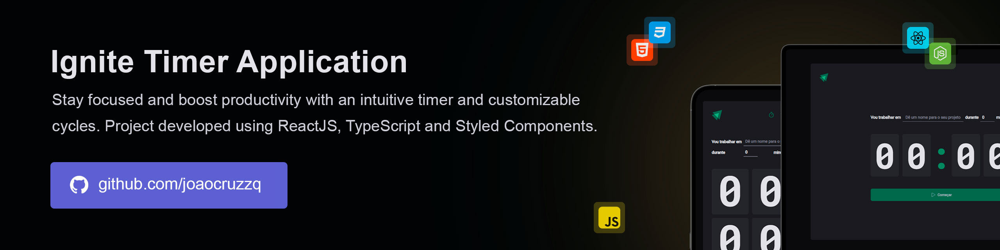

# Ignite Timer  

Ignite Timer is a Pomodoro-inspired timer designed to boost productivity and focus by alternating work sessions with short, energizing breaks. With a clean and user-friendly interface, it helps users manage their time effectively and maintain a healthy workflow balance.

> 🔥 Built with the latest web technologies to ensure fast speed, high performance, and a seamless user experience. It leverages modern tools to deliver a responsive and intuitive interface across devices.



## Running

Follow these steps to run the project locally:

1. Clone the repository:
   ```sh
   git clone https://github.com/joaocruzzq/ignite-timer.git
   cd ignite-timer
   ```

2. Install dependencies:
   ```sh
   npm install
   ```

3. Run the application:
   ```
   npm run dev
   ```

> Note: Make sure you have <a href="https://nodejs.org/pt">Node.js</a> installed before starting.

## Features

> This application **should be able to**:

- start a new work cycle with customizable time settings.
- interrupt an active cycle if you need a break.
- mark cycles as complete to track your progress.
- view the history of all cycles: completed, interrupted, and ongoing.

## 🛠️ Technologies Used

| **Technology**        | **Description**                                                   | **Version** |
|-----------------------|-------------------------------------------------------------------|-------------|
| **React**             | A frontend library for building the user interface.              | 18.2.0      |
| **TypeScript**        | A typed superset of JavaScript that provides static types.        | 4.9.4       |
| **Vite**              | A fast build tool and development server.                         | 4.0.0       |
| **Styled Components** | A library for styling React components using tagged template literals. | 5.3.6       |
| **Date-fns**          | A lightweight library for working with dates in JavaScript.       | 2.28.0      |
| **Immer**             | A library that simplifies working with immutable data structures. | 9.0.6       |
| **Zod**               | A TypeScript-first schema validation library.                     | 3.21.4      |
